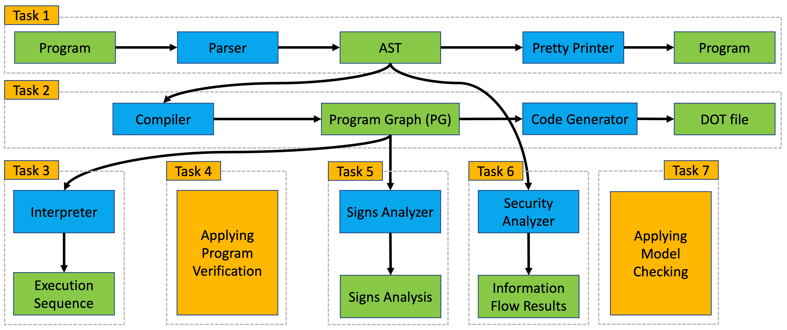

# Assignment

This page provides the goals and guidelines for the assignment of the course 02141 - Computer Science Modelling.
The individual tasks will be published throughout the course; see below for publication dates and deadlines.

> **Please read this document carefully as it explains the goals and rules of the assignment. If you find some inconsistency or unclear point, please create a gitlab issue.**

This document is structured as follows:

- [Assignment](#assignment)
  - [Goals](#goals)
  - [Rules and Guidelines](#rules-and-guidelines)
    - [Groups and Submissions](#groups-and-submissions)
    - [Submissions](#submissions)
    - [Code](#code)
  - [Feedback](#feedback)
  - [Evaluation](#evaluation)
  - [Getting Started](#getting-started)

## Goals

The overall goal of the assignment is to build and use tools for running and analysing programs written in a variant of the Guarded Command Language (GCL); details of the considered language are described [here](gcl.md).

That is, you will learn about the most common steps one encounters when developing a new programming language.
You will also implement and use various tools that help programmers to write correct programs in that language.
Some components of the assignment are present in [http://www.formalmethods.dk/fm4fun](http://www.formalmethods.dk/fm4fun).

The assignment is divided into seven tasks. Some of the tasks correspond to a module of your tool, whereas others involve writing models for existing tools.
We will publish the task description gradually according to the following schedule:

| TASK | Publication Date | Deadline |
| --- | --- | --- |
| 1 - Parser | March 4 | March 10 |
| 2 - Compiler | March 10 | March 13 |
| 3 - Interpreter | March 13 | March 20 |
| 4 - Verification | March 25 | April 3 |
| 5 - Security | April 8 | April 21 |
| 6 - Sign analysis | April 25 | May 1 |
| 7 - Model Checking | May 6 | May 12 |

The overall structure of the assignment is illustrated below, where green boxes are inputs and outputs of your tool; blue boxes represent components that you have to implement.
Orange boxes represent tasks in which you will write models and use existing tools. 

For every task, you have to prepare *two submissions*: the *coding submission*, which is submitted as a group by pushing to your group's repository, and the *questionaire submission*, which is an *individualized* questionaire that you have to submit via DTU Learn. The individual task descriptions will clarify what needs to be handed in as part of the *coding submission* and what needs to be handed in as part of the *questionnaire submission*.

We briefly describe the aims of each task:

1. In [task 1](task1.md), you will implement a *parser* that takes a program in our new programming language and turns it into an abstract syntax tree (AST) - one of the main data structures used by the other components. To test your implementation, you will also implement a *pretty printer* (i.e. a code generator) that traverses the AST and outputs the original program in a nice format.  
2. In [task 2](task2.md), you will implement a *compiler* that takes the AST of a program and constructs its program graph (PG) - another data structure used for running and analyzing programs. To simplify debugging, you will also implement a *printer* that outputs a graphical representation of program graphs. 
3. In [task 3](task3.md), you will implement an *interpreter* that takes a program graph and an initial memory and computes the program's (complete) execution sequences when started on that memory. 
4. In tasks 4 - 7, you will use and implement tools that help programmers with writing correct programs:
    - In [task 4](task4.md), you will be using a *program verifier* to show that various programs behave as intended.
     - In [task 5](task5.md), you will implement another program analysis that checks whether your program leaks confidential information. 
    - In [task 6](task6.md), you will implement a *sign analysis* that determines the signs of variables at every point of a program's execution; such information can be used to detect bugs, such as a division by zero, before actually running the program.  
    - In [task 7](task7.md), you will be using a model checker to analyse properties of concurrent programs. 

## Rules and Guidelines

### Groups and Submissions

- The assignment has been designed for individual submissions, i.e. the workload is adequate for completing the project alone. However, we strongly recommend forming groups for a more comprehensive learning experience (i.e. to also train your ability to explain your ideas and solutions).
- You can form groups up to size 3 to support each other.
    * The *strict* deadline for forming groups is Monday, 17 February, at 12:00 Copenhagen time.
    * After the deadline, everyone who does not belong to a group will be assigned to a 1-person group.
    * The group composition cannot be changed after the deadline. So, please be sure that you agree on mutual expectations and ambitiions before forming the group.
    * If serious issues arise with your group, such as health issues or harassment, contact us ASAP.
- All group members are responsible for the entirity of the *coding submissions*. “My group members worked on this part” is not an excuse.
  
### Submissions

- You can submit the *coding submissions* and the *questionnaire submissions* in any order. 
- The *questionaire submissions* are **individual**, i.e. you must submit your own solutions via DTU learn.
- You have to use your group's repository on DTU gitlab to work on the *coding submissions*
    * If you do not know your group's repository, contact the teachers.
    * If you have not used git before, you can find [tutorials online](https://git-scm.com/docs/gittutorial).
- All solutions to the *coding submissions* must be handed in by comitting *and pushing* them to your group's git repository.
- You can push to your group's repository as often as you want. We will consider the last push before each task's deadline as your *coding submission*.

### Code

- Your solutions must be implemented in F#. We expect you to be familiar with F# as covered in the course [02157 - Functional Programming](https://kurser.dtu.dk/course/02157), which is a prerequisite for this course.
- You are allowed to add your own functions, types, files, etc. but ***do not modify any code in the existing files of the provided code framework unless it is explicitly allowed by a comment of the form `// TODO: start here`.***
- You have to implement your solutions within the code framework provided in this repository. 
- You have to implement the techniques presented in the teaching material.
- You are allowed to add more files but do not forget to add them to your git repository.

## Feedback

We will *not* publish solutions of any assignment tasks.

Instead, we encourage you to proactively seek feedback from the TAs and the teacher in class during lab days.

We will also provide some feedback using an automated evaluation tool.

## Evaluation

Our environment gives you instant feedback and lets you compare your solution to a reference solution.

We want to encourage you to design, implement, test, and analyze your code carefully and to be able to use the course tools for solving relevant problems. 
Hence, your final submissions will be checked by a more powerful evaluation tool.
In other words: even if the instant feedback and reference solution do not reveal any errors, the final evaluation might still be able to spot some errors.
We may also manually inspect your submissions.

The assignment submissions contribute to the overall asssesment of the course. As a rule of thumb, you will pass with half of all tests passing in your *coding submissions*, and half of all questions answered correctly in the *questionaire submissions*. Better results contribute to a better final grade.

## Getting Started

Your group's repository contains the skeleton of a parser along with the input and output types for each task in the assignment. It also contains an example of a "calculator" program in F# that reads an arithmetic expression from the command line and print the result of evaluating such expression for initial testing.

We recommend going through the calculator example in your group's repository and making sure that you can build and run the example code. 

Further details are found in the [README.md](https://github.com/team-checkr/fsharp-starter) in your group's repository.
